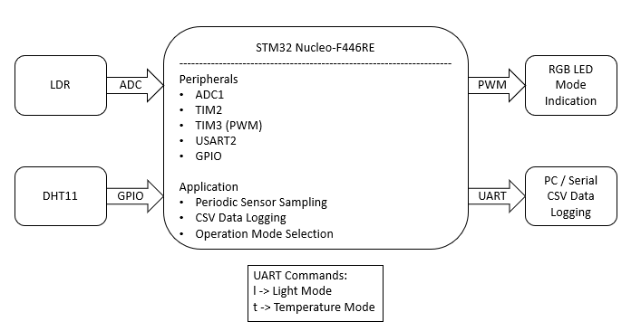
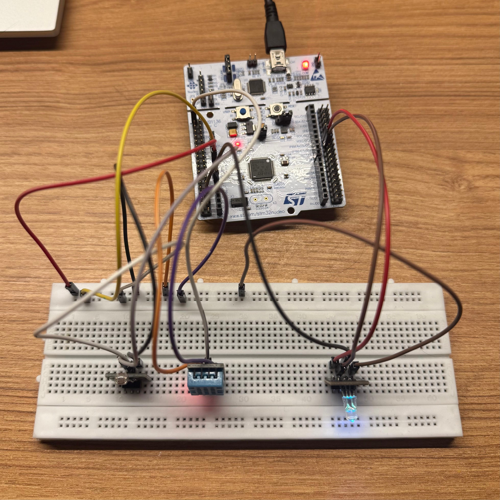
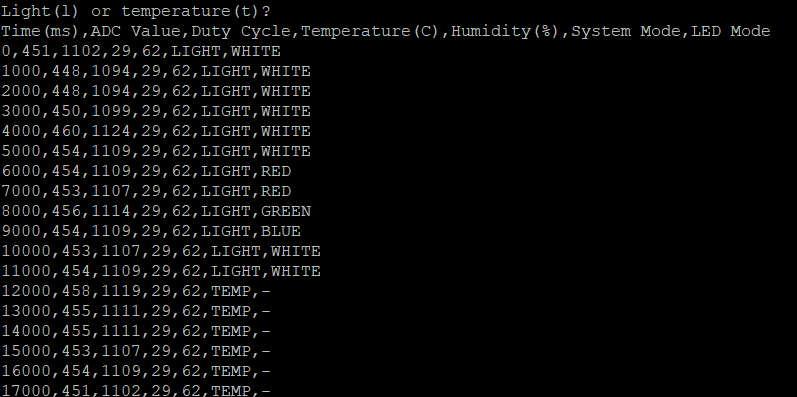
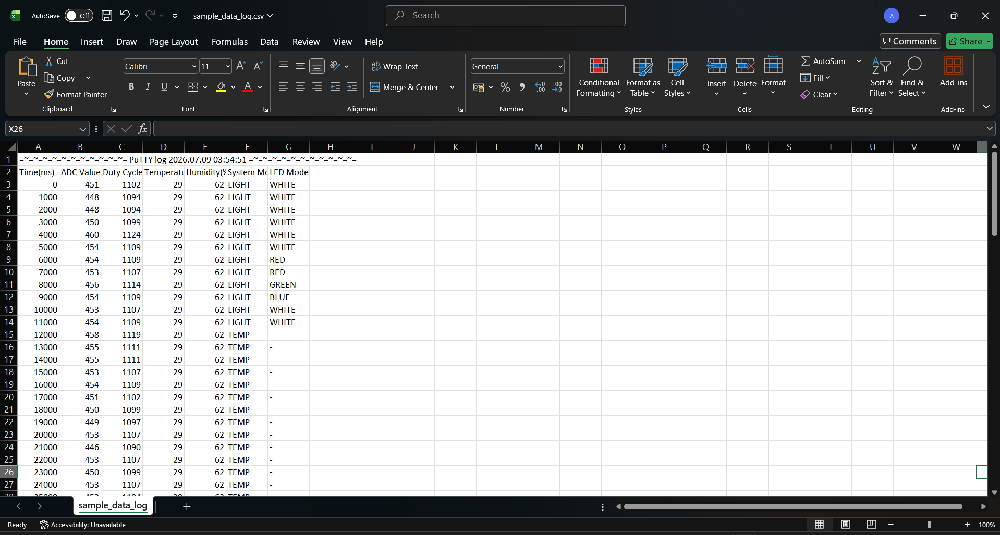
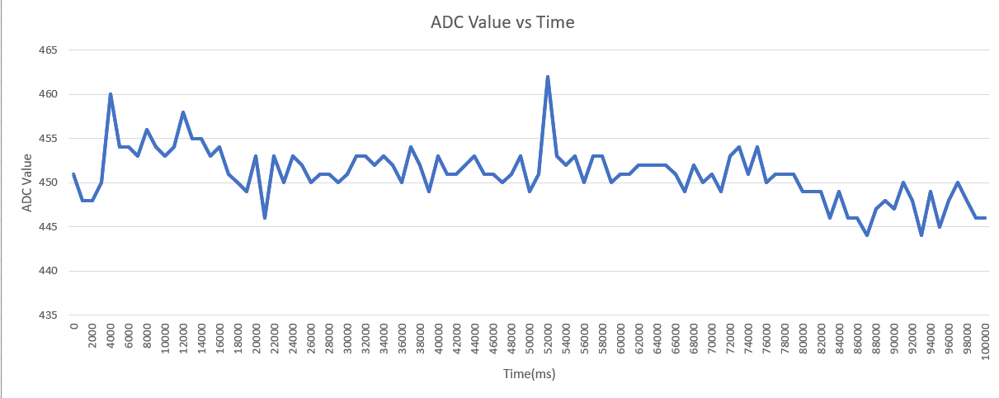

# STM32-Based Real-Time Data Acquisition and Logging System

## Overview

This project implements a real-time environmental monitoring and data logging system using the STM32 Nucleo-F446RE development board.

The system periodically acquires ambient light intensity, temperature, and humidity, processes the acquired data, controls an RGB LED based on the selected operating mode, and continuously logs the sensor readings in CSV format over UART for real-time monitoring and analysis.

---

## Features

- Periodic sensor sampling using TIM2 interrupts
- Ambient light measurement using an LDR (ADC)
- Temperature and humidity measurement using a DHT11 sensor
- RGB LED control using PWM
- UART-based CSV data logging
- On-board USER button controlled LED colour selection
- UART command-based operating mode selection
- Real-time environmental monitoring
- Two operating modes:
  - **Light Mode**
  - **Temperature Mode**

---

## Hardware Used

- STM32 Nucleo-F446RE Development Board
- DHT11 Temperature and Humidity Sensor
- LDR (Light Dependent Resistor)
- RGB LED
- Breadboard
- Jumper Wires
- USB Cable

---

## Software Used

- STM32CubeIDE
- STM32CubeMX
- STM32 HAL (Hardware Abstraction Layer)
- PuTTY (Serial Terminal)
- Microsoft Excel (CSV visualization)

---

## System Architecture



---

## Hardware Setup



---

## Working Principle

The system periodically samples environmental data using a timer interrupt. Ambient light intensity is acquired through the ADC using an LDR, while temperature and humidity are measured using a DHT11 sensor.

The acquired sensor data is transmitted over UART in CSV format for real-time monitoring and logging on a host computer.

The RGB LED operates in one of two user-selectable modes:

- **Light Mode:** The LED brightness is controlled by the ambient light intensity, while the push button cycles through different LED colours (White, Red, Green and Blue).

- **Temperature Mode:** The LED colour represents the measured temperature, transitioning from blue (low temperature) to red (high temperature).

The operating mode can be changed at runtime through UART commands without reprogramming the microcontroller.

---

## Operating Modes

### Light Mode

- Ambient light intensity is measured using the LDR.
- The ADC reading is converted into a PWM duty cycle.
- The RGB LED brightness follows the measured light intensity.
- The push button cycles between four LED colours:
  - White
  - Red
  - Green
  - Blue
- Sensor readings are continuously logged over UART in CSV format.

### Temperature Mode

- Temperature and humidity are measured using the DHT11 sensor.
- The RGB LED colour represents the measured temperature:
  - Blue → Low temperature
  - Purple → Moderate temperature
  - Red → High temperature
- UART continues logging all sensor readings in CSV format.

  ---

## Results



The system successfully demonstrates:

- Periodic real-time acquisition of environmental data
- Simultaneous monitoring of light intensity, temperature and humidity
- RGB LED indication based on the selected operating mode
- UART-based CSV logging for further analysis
- Reliable operation using timer interrupts and STM32 HAL drivers

Example CSV output:



Example graph generated from the logged sensor data.




## Skills Demonstrated

- Embedded C Programming
- STM32 HAL Driver Development
- GPIO Configuration
- ADC Interfacing
- PWM Generation
- UART Communication
- Timer Interrupts
- External Interrupts (EXTI)
- Sensor Interfacing
- Real-Time Data Acquisition
- Data Logging
- Finite State Machine Design
- Embedded System Debugging

---

## Future Improvements

- DMA-based UART communication
- FreeRTOS task scheduling
- SD card data logging
- OLED/LCD display integration
- Moving average filtering for sensor readings
- I²C/SPI sensor support
- Wireless data transmission using Bluetooth or Wi-Fi

---

## Repository Structure

```
.
stm32-real-time-data-acquisition-logging-system
│
├── Core/
├── Drivers/
├── Images/
├── Results/
├── Docs/
├── README.md
├── Data_Acquisition.ioc
├── STM32F446RETX_FLASH.ld
└── STM32F446RETX_RAM.ld
```

---

## Author

**Atharva Vemulapalli**

B.E. Electronics and Communication Engineering  
BITS Pilani, Hyderabad Campus
